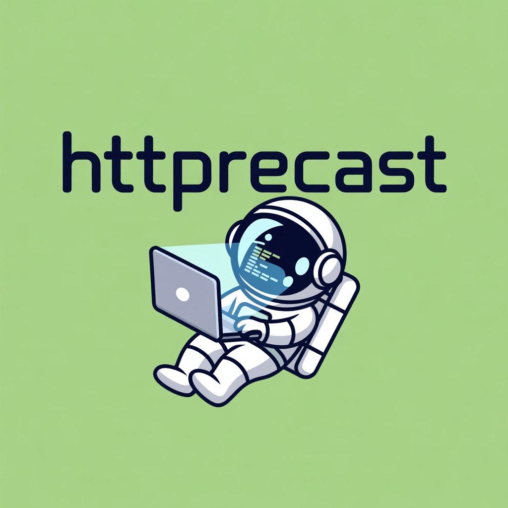

 

# Projeto Podcast Gerado por I.A.s

Projeto com o objetivo de gerar um podcast utilizando ferramentas de IA através de prompts mais trabalhado.

Utilize uma esteira de prompts para gerar cada etapa do processo criativo.

## 💻 Tecnologias utilizadas no projeto

- [ChatGPT](https://chat.openai.com/)
- [IdeogramAI](https://ideogram.ai/)
- [ElevenLabs](https://beta.elevenlabs.io/)
- [Shotcut](https://www.shotcut.org/)

## ✨ Como foi feito ?

- Nome e Roteiro gerado via chatgpt
- Audio gerado pela elevenLabs
- IdeogramAI Para gerar capas
- Shotcut para editar os áudios e criar o vídeo de fundo
